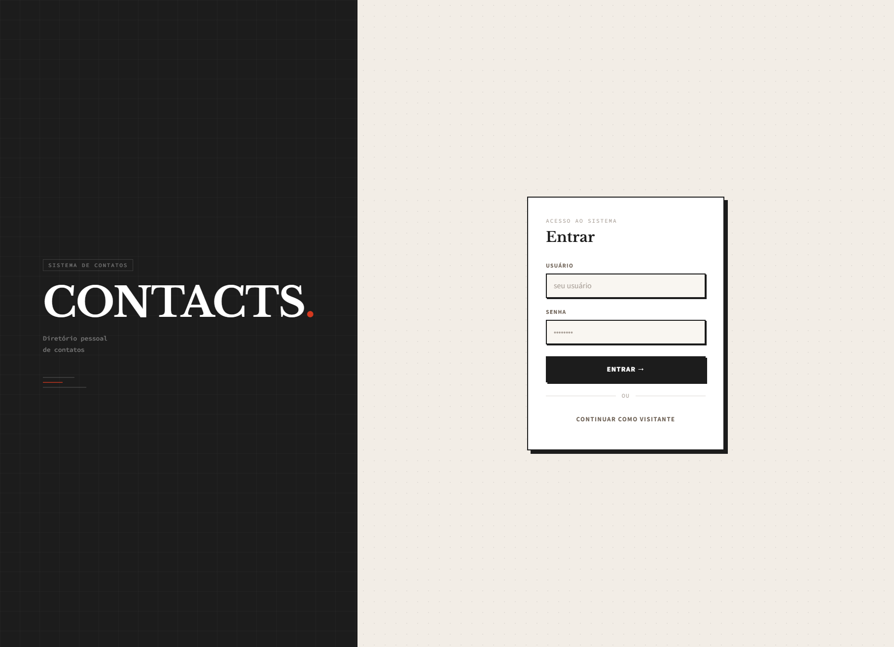
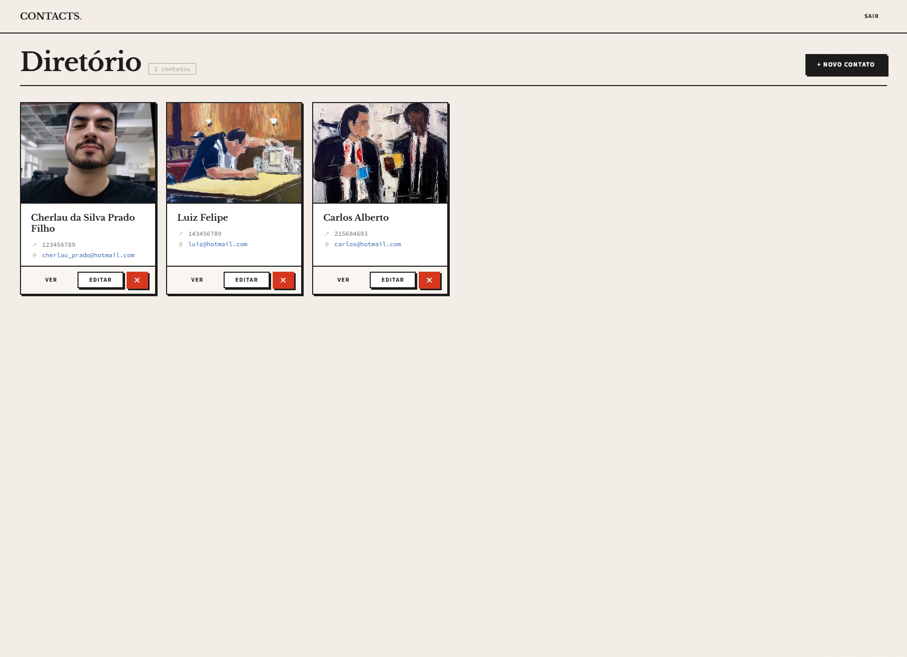

# NodeJS Contacts

Aplicação web para gestão de contatos, desenvolvida com Node.js e Vue.js.

**Aplicação em produção:** https://cherlaufilho-nodejs.recruitment.alfasoft.pt

---

## Acesso ao site

```
Utilizador: admin
Senha: admin
```

---

## Screenshots




---

## Tecnologias utilizadas

**Backend**
- Node.js + Express 5
- mysql2 (SQL puro, sem ORM)
- Multer (upload de imagens)
- JWT + bcryptjs (autenticação)
- Jest + Supertest (testes)

**Frontend**
- Vue 3 (Composition API, `<script setup>`)
- Vue Router (history mode)
- Pinia (gestão de estado)
- Axios
- Vite

**Base de dados:** MariaDB (remota)

---

## Funcionalidades

- Listagem de todos os contatos na página inicial, exibidos como cards com foto e dados
- Página de detalhe do contato
- Adicionar novo contato (requer autenticação)
- Editar contato existente usando o mesmo formulário (requer autenticação)
- Eliminar contato com modal de confirmação (requer autenticação)
- Autenticação JWT — rotas públicas para visualização, protegidas para alterações
- Validação de formulário no frontend e no backend
- Contato e email únicos — não é possível duplicar

---

## Estrutura do projeto

```
nodejs-contacts/
├── config/
│   └── database.js           # pool de ligação mysql2
├── controllers/
│   ├── authController.js     # login, geração do JWT
│   └── contactsController.js # handlers CRUD + validações
├── middleware/
│   ├── auth.js               # verificação do JWT
│   └── upload.js             # configuração do Multer
├── routes/
│   ├── auth.js               # POST /api/auth/login
│   └── contacts.js           # CRUD /api/contacts
├── tests/
│   └── contacts.test.js      # Jest + Supertest
├── frontend/
│   └── src/
│       ├── api/              # camada Axios
│       ├── stores/           # stores Pinia
│       ├── services/         # lógica de negócio
│       ├── composables/      # lógica Vue reutilizável
│       ├── components/       # componentes UI
│       └── views/            # páginas
├── dist/                     # build do frontend (servido pelo Express)
├── uploads/                  # imagens dos contatos
└── server.js
```

---

## Endpoints da API

| Método | Rota | Auth | Descrição |
|--------|------|------|-----------|
| POST | /api/auth/login | Não | Login, retorna JWT |
| GET | /api/contacts | Não | Listar todos os contatos |
| GET | /api/contacts/:id | Não | Detalhe do contato |
| POST | /api/contacts | Sim | Criar contato |
| PUT | /api/contacts/:id | Sim | Editar contato |
| DELETE | /api/contacts/:id | Sim | Eliminar contato |

### Regras de validação
- `name`: obrigatório, mais de 5 caracteres
- `contact`: obrigatório, exatamente 9 dígitos
- `email`: obrigatório, formato válido
- `picture`: obrigatório no POST (multipart/form-data)
- `contact` e `email` devem ser únicos

---

## Executar localmente

### Pré-requisitos
- Node.js 18+
- Acesso à base de dados MariaDB remota (ou instância MySQL local)

### Instalação

```bash
# Instalar dependências do backend
npm install

# Criar o ficheiro .env na raiz do projeto
cp .env.example .env
# Preencher as credenciais da BD e o JWT_SECRET

# Instalar e compilar o frontend
cd frontend
npm install
npm run build
cd ..

# Iniciar o servidor
npm start
```

A aplicação fica disponível em `http://localhost:3000`.

Para desenvolvimento do frontend com hot reload:
```bash
cd frontend
npm run dev
```

### Variáveis de ambiente

```
DB_HOST=
DB_USER=
DB_PASSWORD=
DB_NAME=
DB_PORT=3306
JWT_SECRET=
PORT=3000
```

---

## Testes

Os testes correm contra a base de dados real. Certifique-se que o ficheiro `.env` está configurado antes de executar.

```bash
npm test
```

Cobertura de testes:
- `POST /api/contacts` — retorna 401 sem token
- `POST /api/contacts` — retorna 400 com nome, contato ou email inválidos, ou sem imagem
- `PUT /api/contacts/:id` — retorna 400 com dados inválidos, 404 para id inexistente
